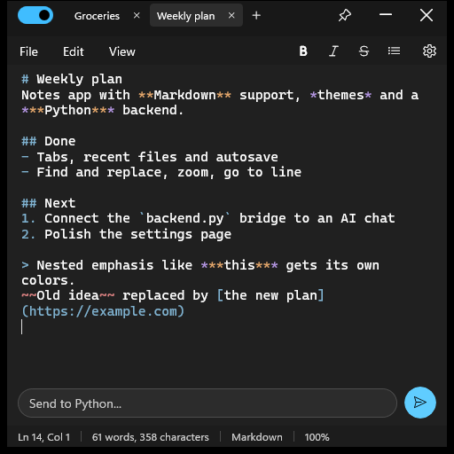
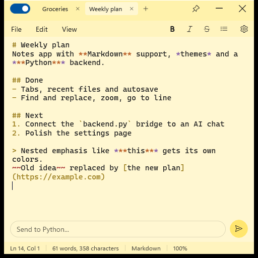
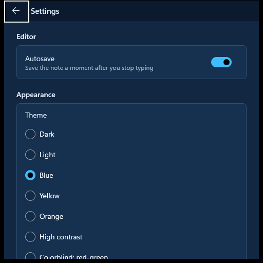

# NotesAIApp

A work-in-progress notes application for Windows, built with C#, .NET and WinUI 3, with an AI chat integration through a Python backend.

**Status:** early development. Design is about 60% done, backend about 20% done.



## Features

- Tabs for multiple notes, restored on the next launch, with recent files and autosave
- Three note types: rich text (.rtf), plain text (.txt) and Markdown (.md), each with its own editing mode
- Markdown syntax coloring, including nested emphasis such as `***bold italic***`
- Find and replace, go to line, zoom
- Formatting tools in the menu bar that adapt to the note type
- Status bar with cursor position, word and character counts, note type and zoom level
- Eight color themes, including high contrast and colorblind-friendly variants
- Prompt field that sends text to the Python backend (the AI chat part is not connected yet)

| Yellow theme | Settings |
| --- | --- |
|  |  |

## Tech stack

- C# on .NET 10
- WinUI 3 (Windows App SDK)
- CommunityToolkit.Mvvm
- Python for the backend

## Getting started

Requirements:

- Windows 10 or 11
- .NET 10 SDK
- Visual Studio 2026 with the WinUI workload, or the `dotnet` CLI
- Python 3 on `PATH`, or the `PYTHON_PATH` environment variable pointing to a Python executable

Build and run from the project folder:

```
dotnet build -p:Platform=x64
dotnet run -p:Platform=x64
```

## Project layout

```
Views/            Main window, editor page, formatting toolbar
ViewModels/       Main view model
Models/           Tabs, editor modes, settings models
Services/         Settings storage, themes, Markdown highlighting, Python bridge
Themes/           Theme resources and color palettes
Python/           Python backend
```

## Roadmap

- Connect the prompt field to an AI chat backend
- Markdown preview
- More settings
